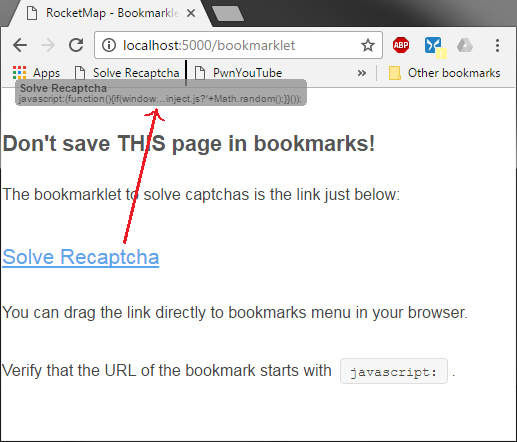
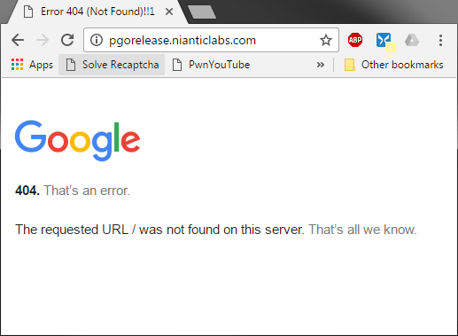
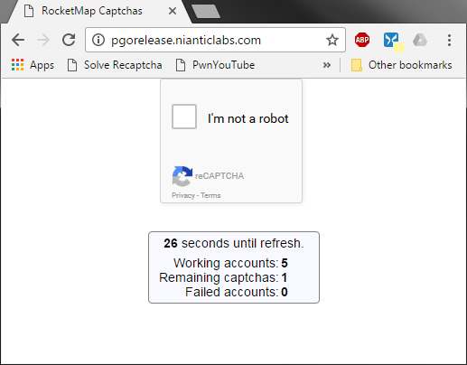

# Handling Captchas

In the following examples we will be using `http://localhost:5000` as the URL where the RocketMap can be accessed (i.e. front-end instance). Please remember that if you want your map to be accessed from the exterior you need to setup the `--host` and `--manual-captcha-domain` to something like `http://<your-ip>:<port>` or `http://<your-domain>:<port>`.

## Enabling Manual/Hybrid Captcha Solving:
You can setup RocketMap to enable manual captcha solving. This feature uses common web browsers to let users rescue captcha'd accounts.
We use a JavaScript [bookmarklet](https://en.wikipedia.org/wiki/Bookmarklet) to trigger the captcha and allow the user to solve it in its web browser.

To enable manual captcha solving you need to add the following parameters:

`python runserver.py -cs -mcd http://localhost:5000`

Or using config.ini:

    captcha-solving: True
    manual-captcha-domain: http://localhost:5000

## Bookmarklet
You can find the required bookmarklet to solve captchas in browser at:

`http://localhost:5000/bookmarklet`

After saving "Solve Recaptcha" link in your bookmarks (preferably in bookmarks menu)
you can start solving captchas!

Click the bookmarklet once to be redirected to `http://pgorelease.nianticlabs.com/`
which is normal to display a 404 error message.

The "magic" happens when you **click in bookmarklet a second time** (while remaining in the same URL).

A similar page to the above should appear and some statistics should be visible.

 - **Working accounts**: counts the total of available accounts (includes captcha'd accounts)

 - **Remaining captchas**: displays the number of accounts waiting for captcha token.

 This number can take some time to refresh since the uncaptcha process can take up to a minute to complete.

 - **Failed accounts**: counts the total of disabled accounts (can include captcha'd accounts if `--captcha-solving` is not enabled)

## Automatic Mode (2captcha)
RocketMap can request tokens for captcha solving from an external service, allowing captchas to be solved "on-the-fly" - meaning that once an account encounters a captcha it immediately starts the uncaptcha process.

If you want to enable this behavior you need to specify:
- Enable captcha solving: `-cs` or `--captcha-solving`

- 2captcha API key: `-ck` or `--captcha-key`

## Hybrid Mode
RocketMap also allows an hybrid mode for captcha solving.

This works by first putting the account aside and waiting for manual captcha solve. After `x` seconds you can force the captcha to be solved by the automatic method (2captcha).

To enable this behavior you need to specify:
- Enable captcha solving: `-cs` or `--captcha-solving`

- 2captcha API key: `-ck` or `--captcha-key`

- Manual captcha timeout: `-mct 1800` or `-manual-captcha-timeout 1800`

The number `1800` indicates how many seconds you want the accounts to wait for manual tokens before resorting to the automatic method (a.k.a. 2captcha).

`-mct` is by default set to `0` which disables this mode and if you have set `-ck` it will only use the automatic mode.

### Sample configuration: Hybrid mode

    captcha-solving: True
    captcha-key: <2Captcha API Key>
    manual-captcha-domain: http://<mydomain.com>:<port>
    manual-captcha-timeout: 1800
