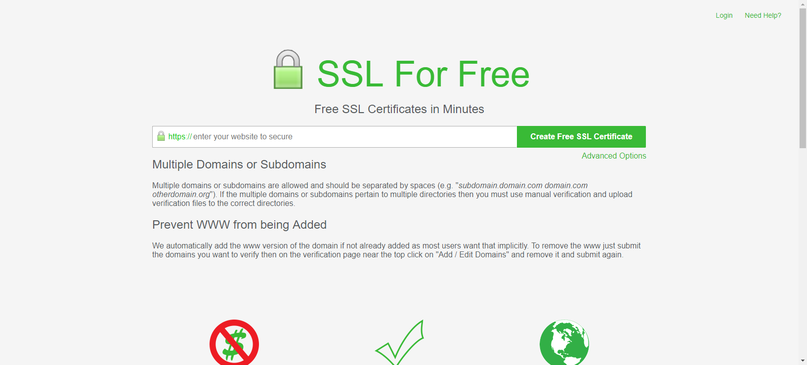
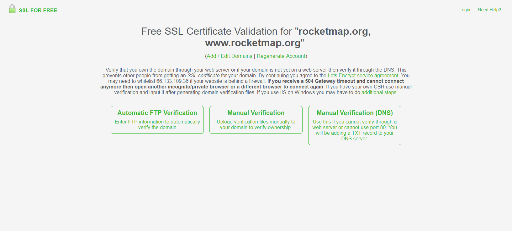
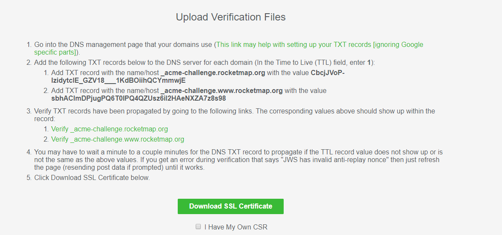
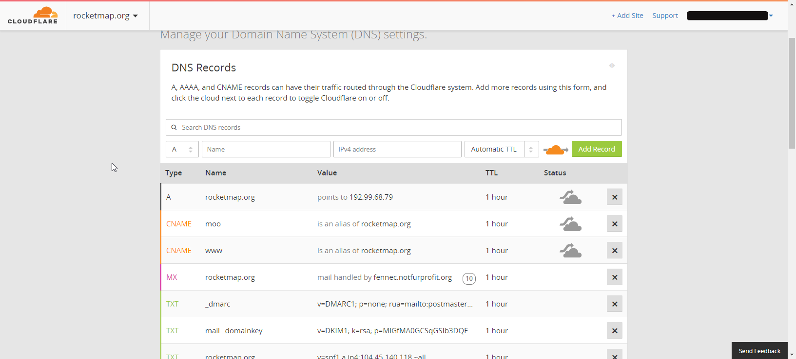
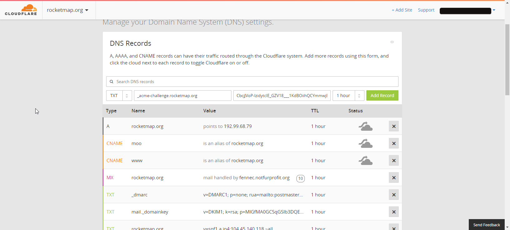
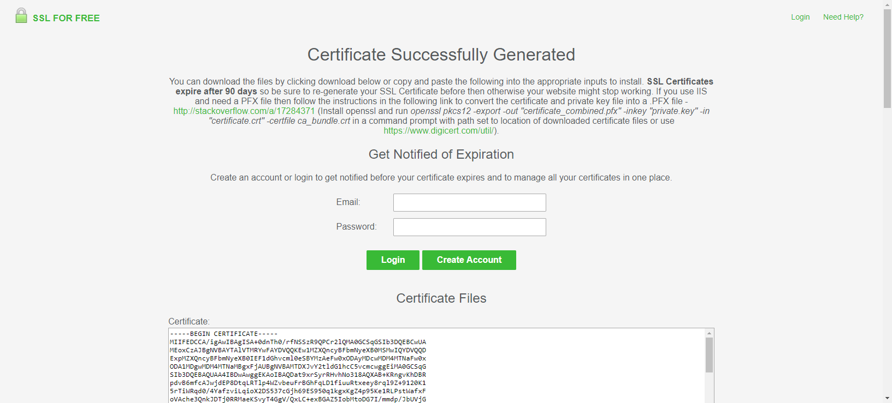

Let's Encrypt Without Certbot
===================

This page is for operating systems such as Windows where ACME clients are not currently well implemented compared to operating systems like Linux.

This method is the simplest as it does not require spinning up any webservers, however, it is the least advanced. You won't be able to do automatic renewals, and you will need to repeat this process every 90 days. 

For these reasons, it is heavily advised you use Certbot if possible.

Please note that in order to use Let's Encrypt or any other public certificate authority, you will need to own a domain. No, IP addresses, HOST file redirects or local DNS will not suffice. It must be a publicly accessible domain.

The demonstration images use CloudFlare's DNS panel as an example. This method should work regardless of DNS provider, and the instructions are more or less the same, but your interface may look a little bit different. Consult your DNS provider's help pages if you are unsure how to navigate your provider's interface.

Part 1: Begin Validation Procedure
----------------------------------

We will be using [SSL For Free](https://www.sslforfree.com/), but there are multiple sites you could use that operate similarly.

Start off by heading to [SSL For Free](https://www.sslforfree.com/). You'll be greeted with the start page.

Type in your domain (or subdomain), and press "Create Free SSL Certificate".

Next, you'll be greeted with the following screen.

Click on "Manual Verification (DNS)". Then, scroll down and click "Manually Verify Domain".

Next, you'll be greeted with the following:

If you are a more experienced user, you can feel free to follow these instructions. If you aren't, not to worry. I'll walk you through it.

Part 2: Adding TXT Records
--------------------------

In a new tab, open up your domain in your DNS provider panel, and find the DNS Records area. You should have something similar to this:

Next, create a new TXT record. The process once again varies with providers, but typically you will have an "Add Record" button, "Add TXT Record", or a dropdown which you can select TXT from.

For the name of the TXT record, copy and paste the value provided by SSL For Free. It should look something like this: `_acme-challenge.rocketmap.org`. For the value, copy and paste the value provided by SSL For Free. It should be random and look something like this: `CbcjJVoP-lzidytcIE_GZV18___1KdBOiihQCYmmwjE`. For the TTL, or Time To Live, you can choose "Automatic". If there isn't an automatic value, enter 1 hour, or 3600 seconds.

Your final record should look similar to the image below:

When you're done, click Add Record, Finish, or whatever option your DNS Provider gives. Repeat the above procedure for the 2nd name and value provided by SSL For Free. This allows your certificate to be valid for both the root domain and www. (If you are generating the certificate for a subdomain, you will probably only have one record provided. Simply ignore this step.)

Once you have added both records, return to SSL For Free, and click "Download SSL Certificate". If you receive errors, restart the process, making sure you entered everything correctly. If you have everything entered correctly, check if your DNS provider has a save button, and make sure that you've pressed it if so. Otherwise, wait about 10 minutes before clicking download, as the records may not have propagated yet.

Part 3: Download the certificate
--------------------------------

After clicking download, you'll receive the following screen:

Congratulations! You've successfully generated a certificate from Let's Encrypt.
 
It is recommended that you create an account to be notified of your certificate expiration.
 
To download your certificate, scroll down and click "Download All SSL Certificate Files". This will download a zip file containing your key, certificate and the certificate bundle. Consult your webserver documentation on how to use these files.
