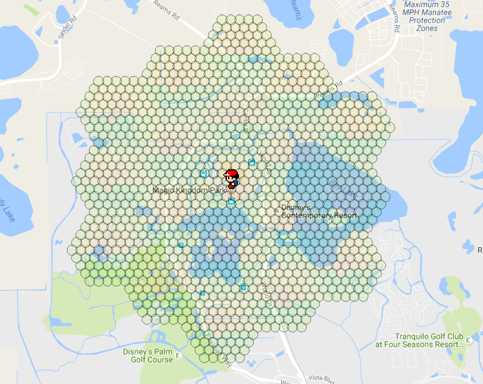
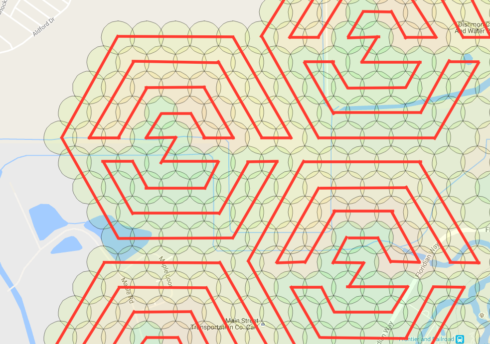

# Beehive Scheduler
Beehive scanning enables your workers to be organized into seperate search areas. This allows you to scan a larger area than by just increasing your `-st` alone. Beehive scanning still allows for `-speed`, however, the worker(s) will be split into seperate areas. 

## Visual Representation



`-bh -st 5 -w 19`

## Option #1: Intergrated beehive
PRO: Quicker Deployment

PRO: Less Memory usage

CON: Less Flexibility



`Example of walking path assignments with 1 wph.`

Command line option `-bh` or `--beehive` enables your workers to be organized into 1 search area per worker by default. The beehive will automatically center around your specified location `-l` and spirials out from there. This method uses the `-st` to determine the size of each hive. You increase the number of hives by adding more workers `-w`. You can also add more than one worker per a hive. For example, you can place two workers in a hive by using `-wph 2`. ***NOTE:*** Adding more than 1 worker per hive is only reccomended if you are using spped scheduler.  

For each `-w`, you must have at least account one account. It is best to have at least 4 accounts per worker. This will allow your workers to always be working, no matter if the account encounters an error. It is also always a great idea to set an Account Search Interval `-asi`. This will limit each account to a certain ammount of search time before putting it to sleep. You can control the ammount of sleep with Account Rest Interval `-ari`. 

### Command line example:

```
python runserver.py -ac accounts.csv -bh -st 5 -w 31 -l "Nashville, TN"
```

## Option #2: Use the RM Multi Location tool. 

PRO: TONS of Flexibility

CON: Uses ***A LOT*** More Memory

CON: Not as easy to make quick changes.  

### Get Ready

The beehive script works by specifying only the parameters that are different for each worker on the command line. All other parameters are taken from [the config file](https://github.com/RocketMap/RocketMap/blob/develop/config/config.ini.example).

To ensure that your beehive will run correctly, first make sure that you have setup your config.ini with the appropriate settings. 

You will want the following to run optimial beehives:
MySQL
Captcha Solving (manual or 2captcha)
possibly a few proxies


### Get Set

[Start here!](https://voxx.github.io/pgm-multiloc/)

Select the areas in which you want to scan. Keep in mind the more areas you select the more workers you will need. 

Once you have the areas ready, select `Generate Launch Script`

You will select the options for your setup and decide how many workers per hive. 

After your scanning preferences are set, you will download the script. 

***Please Note:*** By default, it will look in the folder workers for accounts to use. For every hive you have you must also have have a CSV named `HIVE{number}.csv`. Please do not put a account in more than one CSV as it might cause unwanted effects.  

CSV format example:

```
ptc,username,password
```


### GO!

Run the .bat/.sh file to start the workers.

## Troubleshooting

If your instances start but then immediately stop, take each line and run the part after /MIN starting with the python path. This will stop the window from automatically closing so that you can see what the actual error is.

## Distances


 if using -st 10, these are the numbers you should know: 4.9283 km, 1.425 km, 2.468175 km, 2.85 km - you can use the distances to calculate coords here http://www.sunearthtools.com/tools/distance.php
